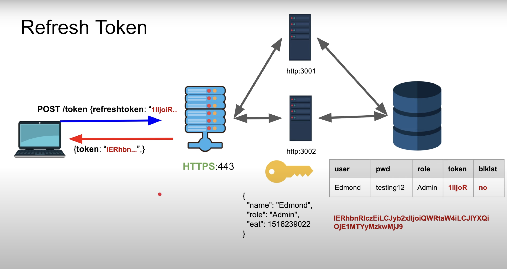

# Json Web Token

## Session based authentication
- When user tries to login if the information is correct, we generate a big long random string and store it in db (same table or other depends on implementation)
- We return this string to the user
- It can be sent as a cookie or in response body
- Now, it is the responsibility of the user to send this string with every request (in cookie or authorization header)
- We check this string in db and if it is present, we allow the user to access the resource
- We can store additional information (any meta) in the db like expiry time, role, name, email, last login etc.

### Is session based authentication stateful or stateless?
- It is stateful as a system i.e., in a way because we have stored the session in db
- But, our application is stateless because we are not storing any information in the server.
- We can destroy one server and start another one and the user will still be logged in. 

### Cons of Session based authentication
- We have to store the session in db
- Every request we make have this extra latency of querying the db
- It takes extra time even if it is a redis or postgres db

### Cache solution
- Store the session in cache (redis, memcached)
- Solves one issue and creates another!
- We can't expire session just by deleting from db because it is also stored in cache
- INCONSISTENCY!

## JWT
- Remember, our system was stateful because we were storing the session in db
- We want the whole system to be stateless
- Magical use-case: give token to another application that has no access to our db, it will still be able to authenticate the user

### Composition
- It has three parts:
    1. Header
    2. Data
    3. Signature

#### Header 
- It is a JSON object
- It contains the type of token and the encryption algorithm used to sign it
```json
{
    "alg": "HS256",
    "typ": "JWT"
}
```

#### Data
- It is also a JSON object
- It is the actual payload of the token
```json
{
    "sub": "1234567890",
    "name": "John Doe",
    "admin": true,
    "eat": 1516239022
}
```

#### Signature
```js
HMACSHA256(
    base64UrlEncode(header) + "." +
    base64UrlEncode(payload),
    "your-256-bit-secret"
)
```

After generating the token, it is same as session based authentication. We send this token to the user and it is the responsibility of the user to send this token with every request.

### Cons of JWT
1. Have to share same secret with all the services
    - **Solution**: use asymmetric encryption
    - **Use-case**: One application can create the token and other can verify it

#### Problem with asymmetric encryption
- It is slow if payload is big

2. Once jwt is stolen, we can't do anything about it until it expires
    - **Solution**: make it short lived
    
#### Causes another problem: user has to login again and again
Banks do that but what if fb does it?


    

